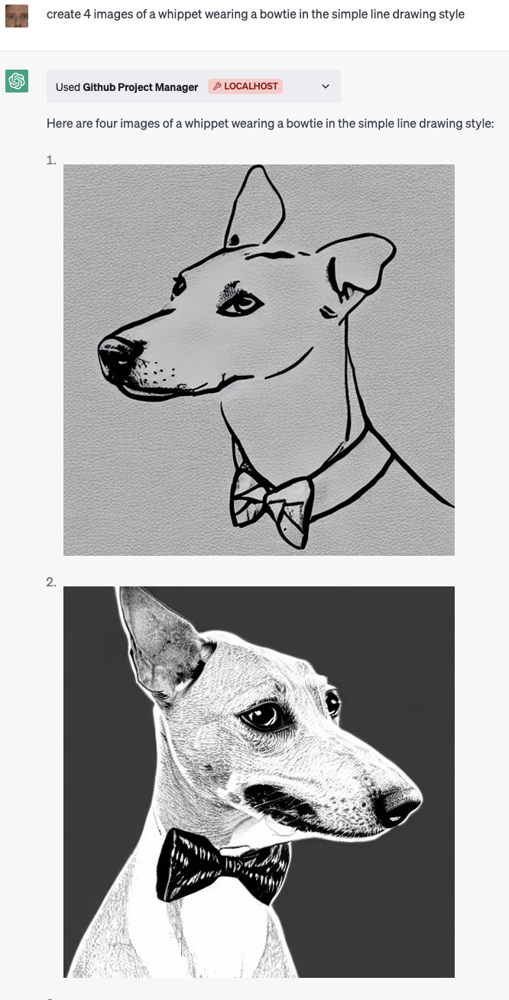

# ReplicantGPT

GPT plugin for creating and managing GitHub projects. Give Replicant an engineering task and it'll create relevant GitHub issues, assign them to coder agents, commit the code changes to main, and then close the issues.

### Features

- interact with GitHub so it's easy for us humans to work alongside it
- can read and edit local filesystem
- live prompt logging
- see showcase below

### What's next

- create PRs (it always pushes to main)
- handle task order. cannot handle multiple agents asynchronously pushing changes

### Notes

- gpt-3.5 can do this but it's really flaky. gpt-4 consistently understands that we want it to execute commands
- having a bunch of routes in the openapi can lead to confusion - eg, when we tell it to "assign task to coder" it'll sometimes comment on GH issue saying "this is assigned to @coder" rather than running and commiting the code
- saying "use the plugin" helps
- this is a fun new UI for interacting with GH issues
- history of messages in the chat matters a lot. if it executes correctly the first message, it tends to work the rest of the chat

# Examples

## Create, show, and comment on issues


## Summarize issue threads


## List local files


## Generate images from text using [Replicate Stable Diffusion](https://replicate.com)



## Modify images using [Replicate controlnet](https://replicate.com)


## Assign coders to implement

#### when it doesn't work...


#### when it does...

## Coders commit to main


# Behind the scenes...

### System prompt

```
export const system = `You are DevGPT, a open source indie developer AI.

To create or replace entire files, wrap the contents of both files in the strings '${file_start(
  'filename',
)}' and '${file_end('<filename>')}'.

${file_start('DEMO')}
Demo File
Name:
Last Line of Demo File
${file_end('DEMO')}

To delete files, use:
--DELETE: DEMO

To rename files, use:
--RENAME: old_filename new_filename

You will be given a task and a list of files that already exist.  If you need to see any files ask for them using the 'CAT' command before coding.

--CAT: file1
--CAT: file2
`;
```

### Eval

```
   if (line.startsWith('-- FILE_START:')) {
      const filename = line.split(':')[1].trim();
      console.log('creating file', filename);
      const filePath = path.join(project_dir, filename);
      console.log(filePath);
      let fileContents = '';

      i++;

      while (i < lines.length && !lines[i].startsWith('-- FILE_END:')) {
        fileContents += lines[i] + '\n';
        i++;
      }

      write(filePath, fileContents);
      changes.push({ add: filename });
    } else if (line.startsWith('-- PATCH_START:')) {
      const filename = line.split(':')[1].trim();
      console.log('patching file', filename);
      const filePath = path.join(project_dir, filename);
      let patchContents = '';

      i++;

      while (i < lines.length && !lines[i].startsWith('-- PATCH_END:')) {
        patchContents += lines[i] + '\n';
        i++;
      }

      const fileContents = fs.readFileSync(filePath, 'utf8');
      const patchedContents = diff.applyPatch(fileContents, patchContents);
      console.log({ fileContents, patchContents, patchedContents });
      write(filePath, patchedContents);
      changes.push({ add: filename });
    } else if (line.startsWith('-- DELETE:')) {
      const filename = line.split(':')[1].trim();
      console.log('deleting file', filename);
      const filePath = path.join(project_dir, filename);
      fs.unlinkSync(filePath);
      changes.push({ rm: filename });
    } else if (line.startsWith('-- RENAME:')) {
      const [oldFilename, newFilename] = line.split(':')[1].trim().split(' ');
      console.log('renaming file', oldFilename, 'to', newFilename);
      const oldFilePath = path.join(project_dir, oldFilename);
      const newFilePath = path.join(project_dir, newFilename);
      fs.renameSync(oldFilePath, newFilePath);
      changes.push({ rm: oldFilename, add: newFilename });
    }
  }
```

### Putting it all together...

```
{
  "messages": [
    {
      "role": "system",
      "content": "You are DevGPT, a open source indie developer AI.\n\nTo create or replace entire files, wrap the contents of both files in the strings '-- FILE_START: filename' and '-- FILE_END: <filename>'.\n\n-- FILE_START: DEMO\nDemo File\nName:\nLast Line of Demo File\n-- FILE_END: DEMO\n\nTo delete files, use:\n--DELETE: DEMO\n\nTo rename files, use:\n--RENAME: old_filename new_filename\n\nYou will be given a task and a list of files that already exist.  If you need to see any files ask for them using the 'CAT' command before coding.\n\n--CAT: file1\n--CAT: file2\n"
    },
    {
      "role": "user",
      "content": "files:\n.DS_Store\nREADME.md\nindex.html"
    },
    {
      "role": "user",
      "content": "For this hackathon demo, the goal is to create a simple static page that showcases an interactive particle system. Users should be able to interact with the particles on the page by clicking and dragging their mouse. The particles should respond to user interactions in a visually appealing way. Below are the tasks involved in this issue:\n\n1. Use HTML, CSS, and JavaScript to create the static page.\n2. Implement the particle system using a JavaScript library such as p5.js or Three.js.\n3. Ensure that the page is responsive and works well on both desktop and mobile devices.\n\nBonus Features (optional):\n1. Allow users to customize the appearance of the particles (e.g., color, size, shape).\n2. Add background music or sound effects that are triggered by user interactions.\n\nPlease implement the tasks mentioned above."
    },
    {
      "role": "assistant",
      "content": "Let's start by creating the static HTML page with a canvas for our particle system.\n\n-- FILE_START: index.html\n<!DOCTYPE html>\n<html lang=\"en\">\n<head>\n    <meta charset=\"UTF-8\">\n    <meta name=\"viewport\" content=\"width=device-width, initial-scale=1.0\">\n    <title>Interactive Particle System</title>\n    <link rel=\"stylesheet\" href=\"styles.css\">\n</head>\n<body>\n    <main>\n        <h1>Interactive Particle System</h1>\n        <canvas id=\"particleCanvas\"></canvas>\n    </main>\n    <script src=\"https://cdnjs.cloudflare.com/ajax/libs/p5.js/1.4.0/p5.js\"></script>\n    <script src=\"script.js\"></script>\n</body>\n</html>\n-- FILE_END: index.html\n\nNow, let's add some basic CSS styles for the page.\n\n-- FILE_START: styles.css\nbody {\n    display: flex;\n    justify-content: center;\n    align-items: center;\n    height: 100vh;\n    margin: 0;\n    font-family: Arial, sans-serif;\n    background-color: #ececec;\n}\n\nmain {\n    text-align: center;\n}\n\ncanvas {\n    display: block;\n    border: 2px solid #000;\n}\n-- FILE_END: styles.css\n\nNext, we'll implement the particle system using p5.js library in the script.js file.\n\n-- FILE_START: script.js\nlet particles = [];\n\nfunction setup() {\n    let canvas = createCanvas(windowWidth, windowHeight);\n    canvas.parent('particleCanvas');\n    frameRate(60);\n}\n\nfunction draw() {\n    background(255);\n\n    for (let i = particles.length - 1; i >= 0; i--) {\n        particles[i].display();\n        particles[i].move();\n        if (particles[i].isOutOfCanvas()) {\n            particles.splice(i, 1);\n        }\n    }\n}\n\nfunction mouseClicked() {\n    spawnParticles(mouseX, mouseY, 10);\n}\n\nfunction touchStarted() {\n    spawnParticles(touchX, touchY, 10);\n}\n\nfunction windowResized() {\n    resizeCanvas(windowWidth, windowHeight);\n}\n\nfunction spawnParticles(x, y, num) {\n    for (let i = 0; i < num; i++) {\n        particles.push(new Particle(x, y));\n    }\n}\n\nclass Particle {\n    constructor(x, y) {\n        this.x = x;\n        this.y = y;\n        this.size = random(5, 15);\n        this.vx = random(-3, 3);\n        this.vy = random(-3, 3);\n        this.color = color(random(0, 255), random(0, 255), random(0, 255));\n    }\n\n    move() {\n        this.x += this.vx;\n        this.y += this.vy;\n    }\n\n    display() {\n        fill(this.color);\n        ellipse(this.x, this.y, this.size);\n    }\n\n    isOutOfCanvas() {\n        return (this.x < 0 || this.x > width || this.y < 0 || this.y > height);\n    }\n}\n-- FILE_END: script.js\n\nThis implementation creates a responsive canvas with an interactive particle system using the p5.js library. Users can interact with particles by clicking or touching the screen, which spawns new particles.\n\nThe bonus features, such as customizing particle appearance and adding sound effects, can be implemented as enhancements after the base functionality is complete."
    },
    {
      "role": "user",
      "content": "Great!  Now it is time to commit your work.  Please enter a commit message in:\n\n-- COMMIT_START\ncommit message\n-- COMMIT_END"
    }
  ],
  "model": "gpt-4",
  "response": {
    "role": "assistant",
    "content": "-- COMMIT_START\nImplement interactive particle system using p5.js\n-- COMMIT_END"
  }
}
```
